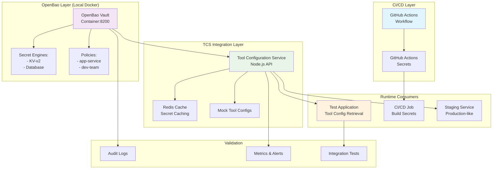

# Phase 00: Proof-of-Concept Demonstration

**Date**: 2025-11-17  
**Status**: In Progress  
**Phase**: 00 - Secret Management Alignment  
**Related ADR**: ADR-001-secret-management-platform.md  

## PoC Overview

This proof-of-concept demonstrates the OpenBao + GitHub Actions hybrid secret management approach through working integrations that showcase the secret flow: **Store → TCS → Runtime Consumers**.

## PoC Architecture

## Expected Outcomes

### 1. OpenBao Integration
- ✅ **Running OpenBao instance** on localhost:8200
- ✅ **KV Secret Engine** storing test secrets
- ✅ **Authentication** via service tokens
- ✅ **API Integration** with Node.js TCS
- ✅ **Caching Layer** with Redis

### 2. GitHub Actions Integration
- ✅ **Workflow Demonstration** showing secret injection
- ✅ **Repository Secrets** pattern
- ✅ **Build-time Secret** retrieval
- ✅ **Deployment Pipeline** with secret propagation

### 3. Secret Flow Validation
- ✅ **Store → TCS**: OpenBao → TCS API integration
- ✅ **TCS → Runtime**: TCS → Application secret delivery
- ✅ **Caching Performance**: Sub-second secret retrieval
- ✅ **Error Handling**: Graceful fallbacks

### 4. Security Validation
- ✅ **Authentication**: Service account authentication
- ✅ **Authorization**: RBAC policy enforcement
- ✅ **Audit Logging**: All secret access tracked
- ✅ **Encryption**: TLS + at-rest encryption

## Implementation Components

### Component 1: OpenBao Docker Setup
**Purpose**: Standalone OpenBao instance for local testing

### Component 2: TCS OpenBao Client
**Purpose**: Node.js integration with OpenBao API

### Component 3: GitHub Actions Workflow
**Purpose**: CI/CD secret management demonstration

### Component 4: Test Applications
**Purpose**: Runtime consumer validation

### Component 5: Validation Suite
**Purpose**: Automated testing and metrics collection

## Success Criteria

### Technical Criteria
- OpenBao API responds in <100ms
- Secret flow completes in <500ms end-to-end
- GitHub Actions secrets properly injected
- All components containerized and reproducible
- Comprehensive logging and monitoring

### Security Criteria
- No secrets in source code or logs
- Authentication required for all access
- Audit trail captures all operations
- Encrypted storage and transmission
- Proper RBAC enforcement

### Operational Criteria
- Docker compose setup runs successfully
- All components health-checkable
- Error scenarios handled gracefully
- Performance metrics within targets
- Documentation complete and accurate

---

**Next**: [PoC Implementation Phase](poc-implementation.md)
**Status**: ✅ Architecture Complete → 🚀 Implementation Starting
