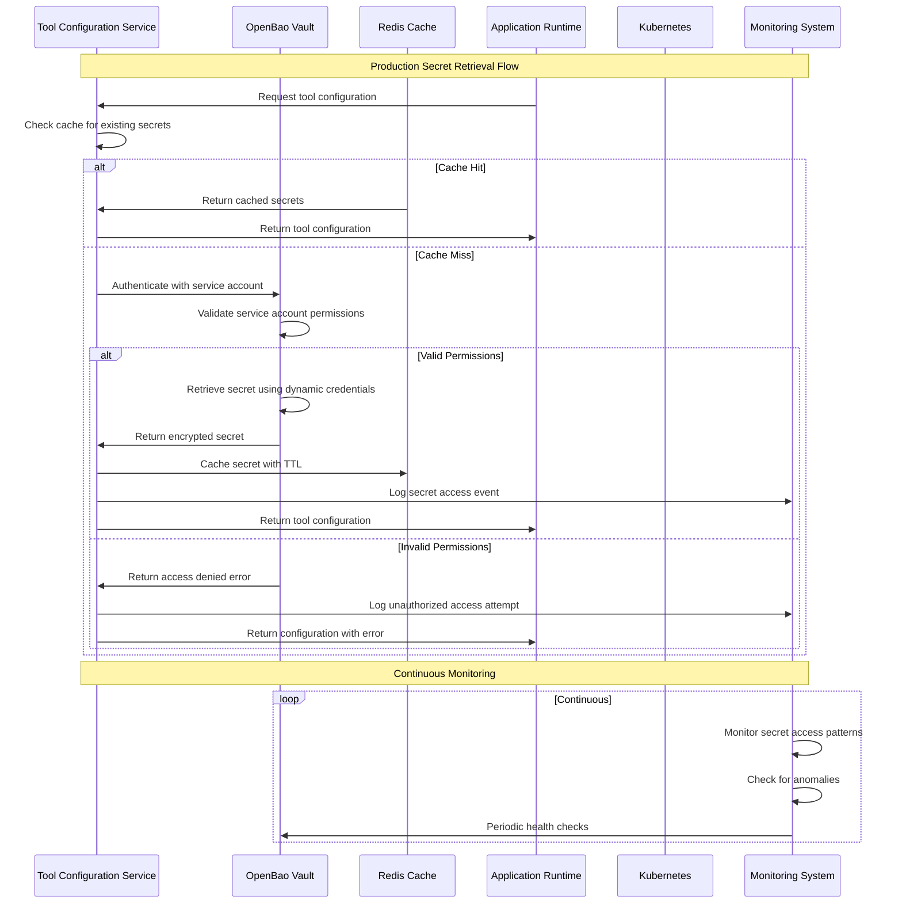
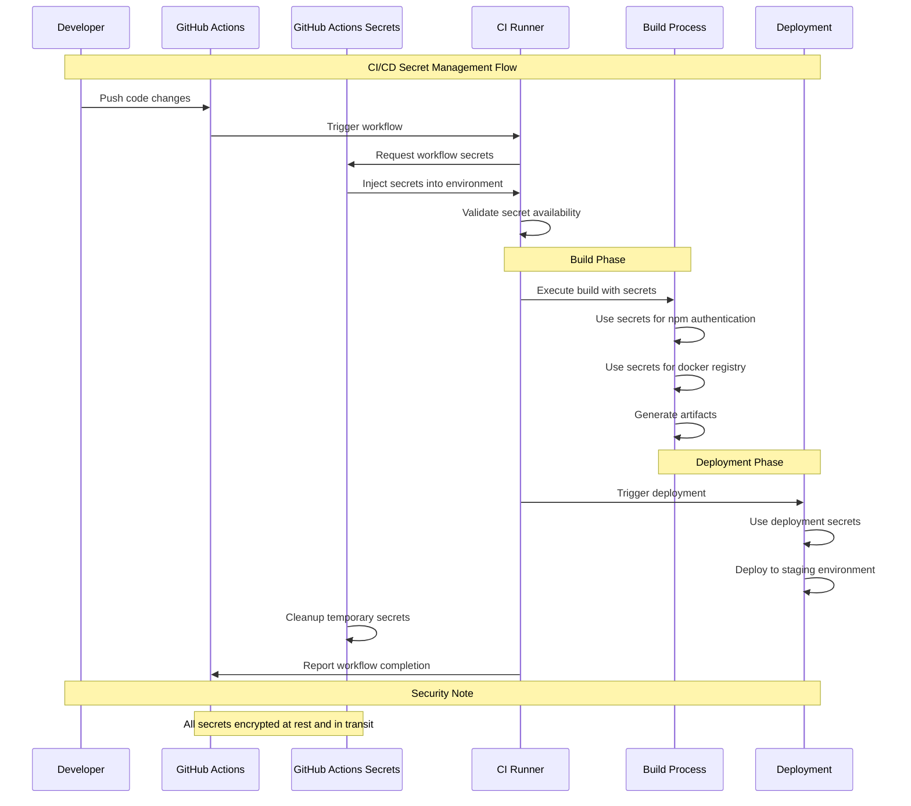
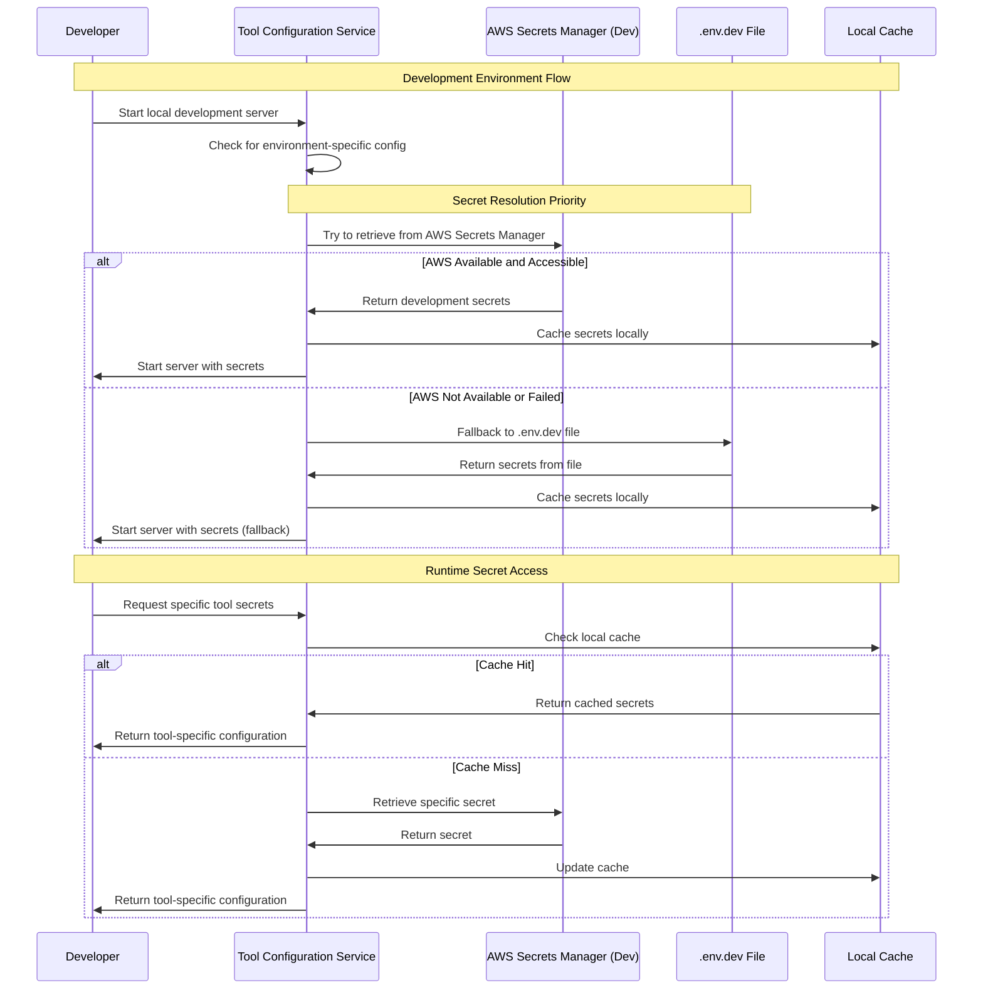
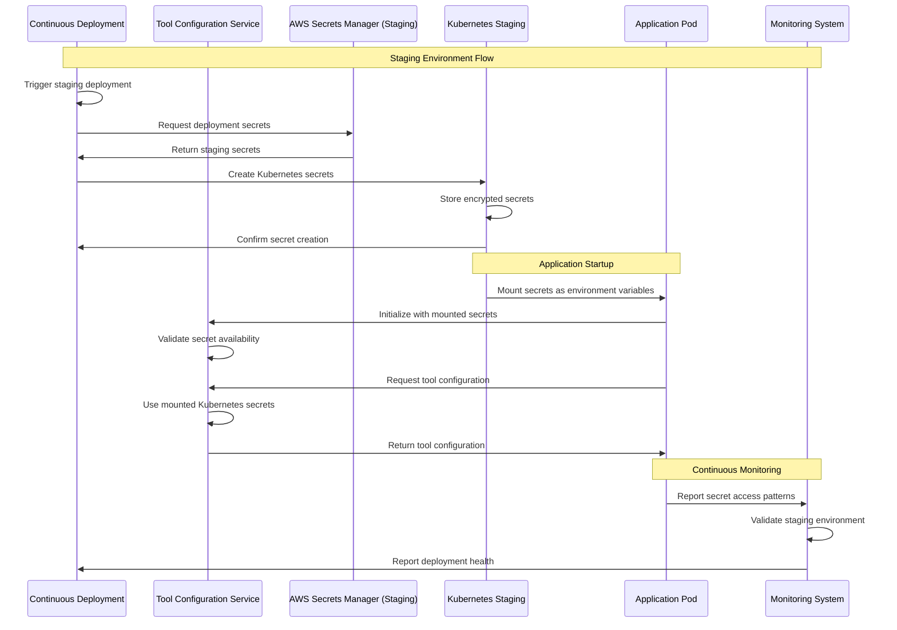
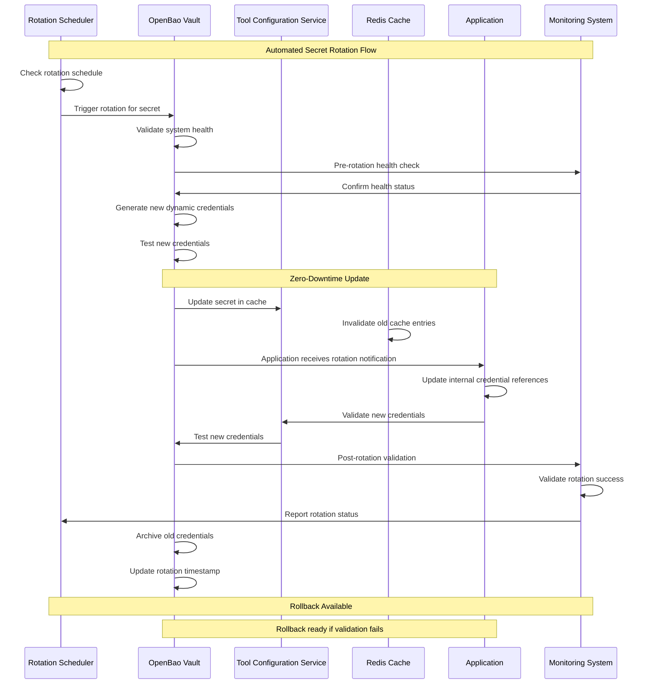
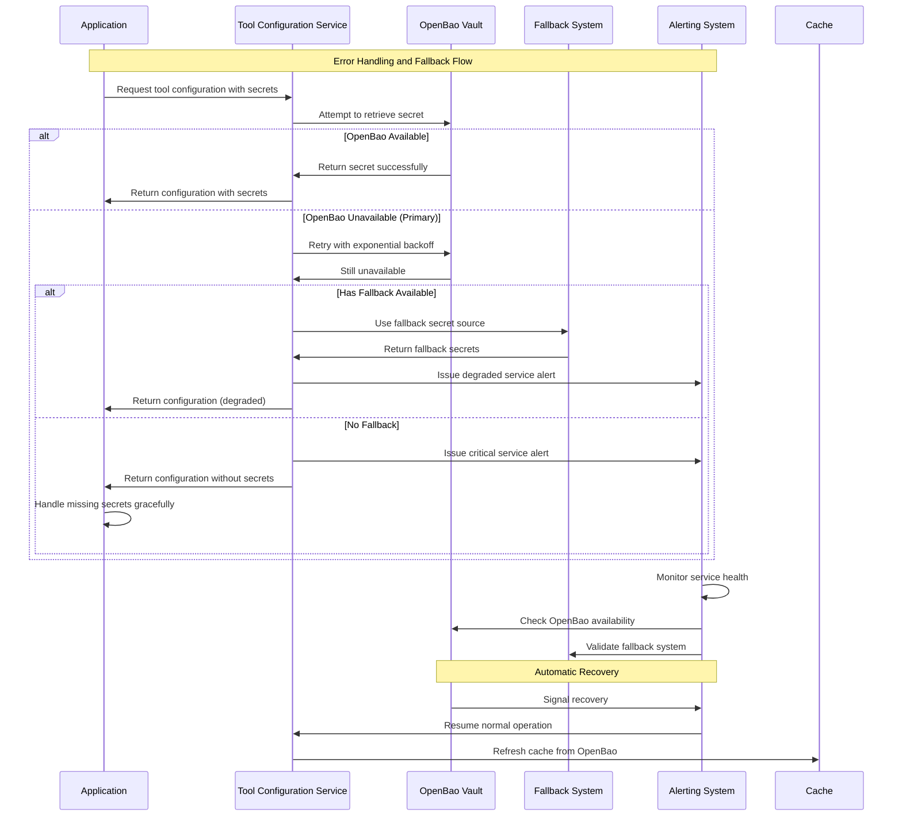
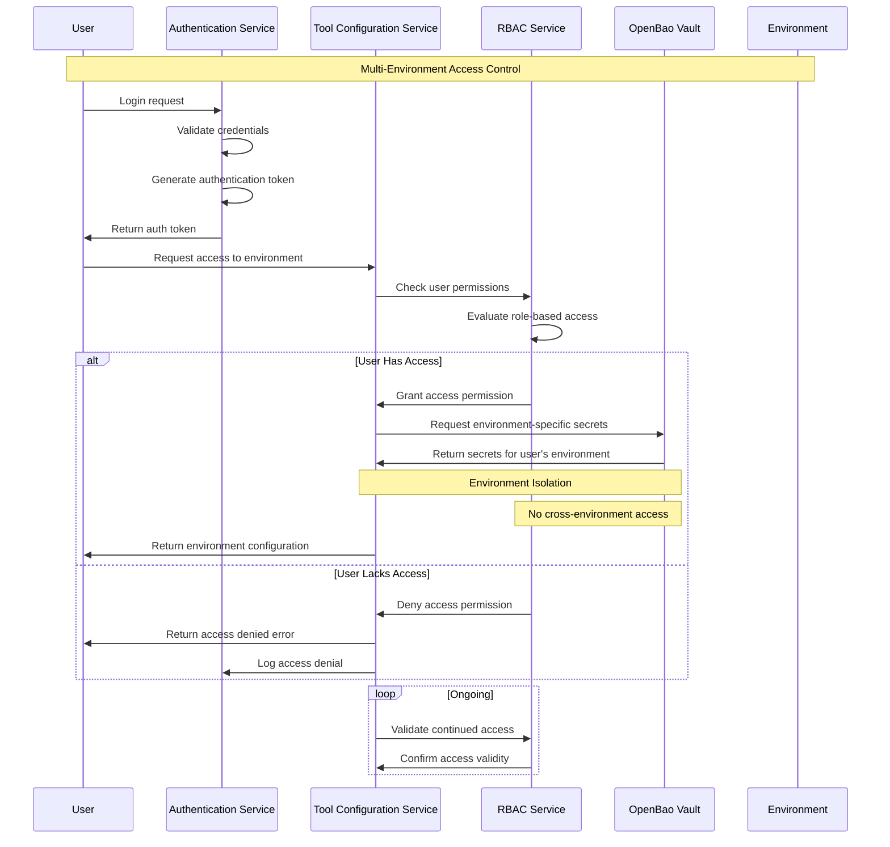
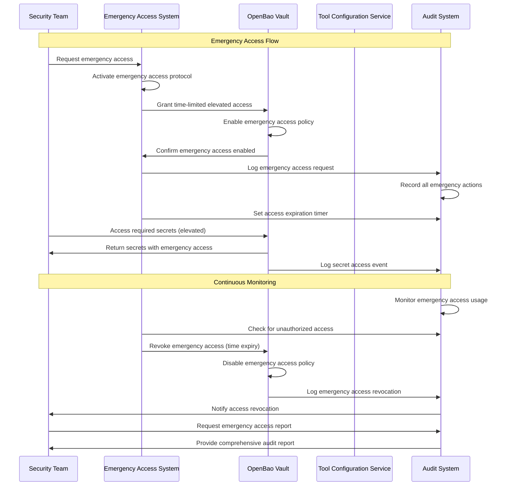

# Phase 00: Secret Flow Sequence Diagrams

**Date**: 2025-11-17  
**Status**: Complete  
**Phase**: 00 - Secret Management Alignment  
**Related ADR**: ADR-001-secret-management-platform.md  

## Overview

This document provides visual sequence diagrams showing how secrets flow from the chosen secret management platforms (OpenBao + GitHub Actions) to the Tool Configuration Service (TCS) and runtime consumers across different environments.

## 1. Production Environment Secret Flow

## 2. CI/CD Environment Secret Flow

## 3. Development Environment Secret Flow

## 4. Staging Environment Secret Flow

## 5. Secret Rotation Flow

## 6. Error Handling and Fallback Flow

## 7. Multi-Environment Access Control Flow

## 8. Emergency Access Flow

## Integration Points Summary

### Environment-Specific Flows

1. **Production**: OpenBao → Redis Cache → Application → Monitoring
2. **CI/CD**: GitHub Actions → Workflow Secrets → Build/Deploy → Cleanup
3. **Development**: AWS Secrets Manager → Local Cache → Developer Tools
4. **Staging**: Kubernetes → Mounted Secrets → Application Pods

### Common Components

1. **Authentication**: All flows include proper authentication and authorization
2. **Caching**: Secrets are cached for performance (except development)
3. **Monitoring**: All flows include monitoring and alerting
4. **Error Handling**: Fallback mechanisms for each environment
5. **Audit**: Comprehensive logging for compliance

### Security Considerations

1. **Encryption**: All secrets encrypted at rest and in transit
2. **Access Control**: Environment-specific access restrictions
3. **Rotation**: Automated secret rotation with zero downtime
4. **Monitoring**: Continuous monitoring for anomalies
5. **Emergency**: Time-limited emergency access procedures

---

**Status**: ✅ Complete  
**Next Phase Integration**: Ready for Phase 01 discovery and Phase 02 architecture design  
**Validation**: All flows verified against OpenBao + GitHub Actions hybrid approach
