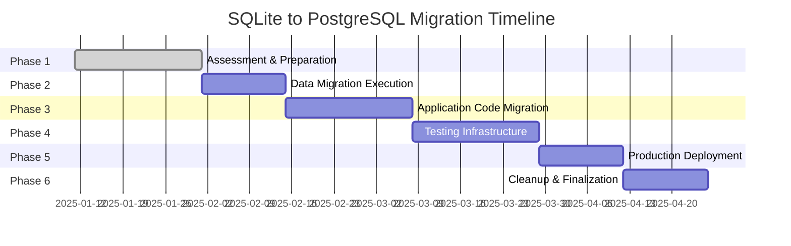
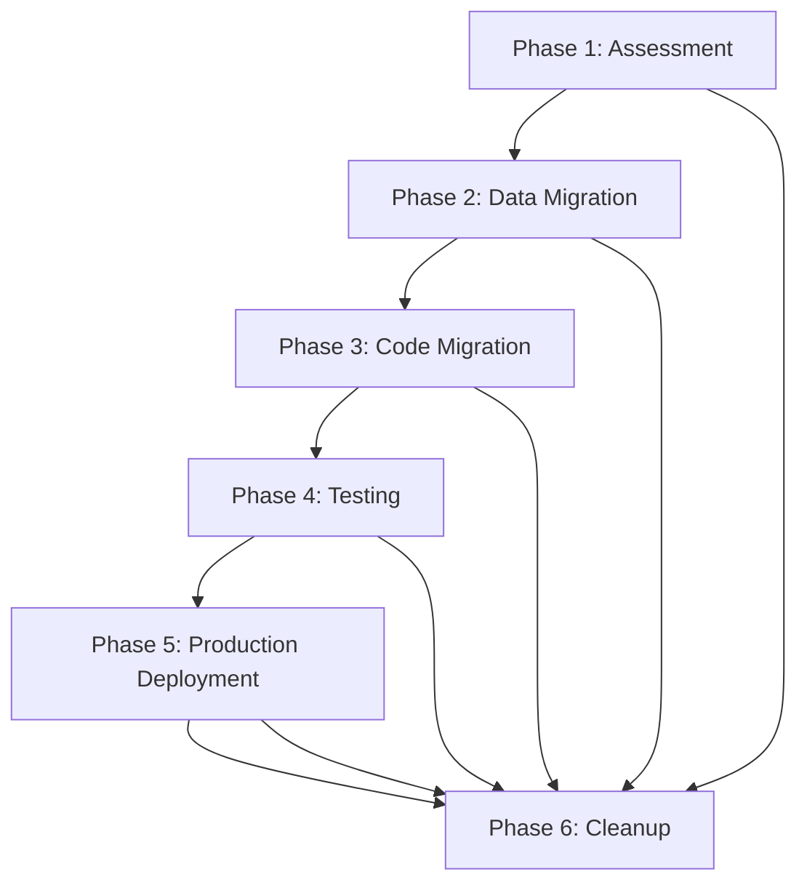

# SQLite Removal Plan - Master Index

## Overview

This directory contains a comprehensive 6-phase plan for removing SQLite from the Hyperpage project and transitioning to PostgreSQL. The plan provides a systematic approach to migration with minimal risk and maximum safety through extensive testing, validation, and rollback procedures.

## Plan Structure

The migration is organized into 6 sequential phases, each building upon the previous one:

### 📋 Phase 1: Assessment & Preparation
**File**: `phase-1-assessment-preparation.md`  
**Duration**: 2-3 weeks  
**Objective**: Complete current state audit and migration preparation

- Complete SQLite dependencies audit
- Migration infrastructure validation
- Data integrity assessment
- Timeline and resource planning
- Risk assessment and mitigation

### 🚀 Phase 2: Data Migration Execution
**File**: `phase-2-data-migration-execution.md`  
**Duration**: 1-2 weeks  
**Objective**: Execute controlled data migration with validation

- Schema migration (DDL)
- Data migration execution
- Data integrity validation
- Performance optimization
- Application integration testing

### 🔧 Phase 3: Application Code Migration
**File**: `phase-3-application-code-migration.md`  
**Duration**: 2-3 weeks  
**Objective**: Update application to use PostgreSQL exclusively

- Database connection layer updates
- Repository pattern modernization
- API endpoint optimization
- Configuration management updates
- Performance optimization

### 🧪 Phase 4: Testing Infrastructure Updates
**File**: `phase-4-testing-infrastructure-updates.md`  
**Duration**: 2-3 weeks  
**Objective**: Comprehensive testing and verification

- Unit testing infrastructure updates
- Integration testing framework
- End-to-end testing updates
- Performance benchmarking
- Load testing and stress testing
- Security testing and validation

### 🌐 Phase 5: Production Deployment Strategy
**File**: `phase-5-production-deployment-strategy.md`  
**Duration**: 1-2 weeks  
**Objective**: Safe production deployment with blue-green strategy

- Production environment preparation
- Blue-green deployment setup
- Production data migration
- Traffic switching and validation
- Post-deployment monitoring

### 🧹 Phase 6: Cleanup & Finalization
**File**: `phase-6-cleanup-finalization.md`  
**Duration**: 1-2 weeks  
**Objective**: Complete cleanup and project closure

- Code repository cleanup
- Configuration cleanup
- Infrastructure cleanup
- Database optimization
- Final documentation updates
- Project closure and handover

## Migration Timeline

## Key Benefits

### Performance Improvements
- **Query Performance**: Expected 25-50% improvement in query response times
- **Concurrent Users**: Support for 2x more concurrent users
- **Database Operations**: Enhanced indexing and query optimization capabilities
- **Connection Pooling**: Improved connection management and pooling

### Scalability Enhancements
- **Horizontal Scaling**: PostgreSQL supports read replicas and sharding
- **Data Volume**: Handles significantly larger datasets efficiently
- **Concurrent Connections**: Higher connection limits and better connection pooling
- **Distributed Operations**: Multi-server deployment capabilities

### Reliability & Security
- **Data Integrity**: ACID compliance with advanced transaction support
- **Backup & Recovery**: Point-in-time recovery and automated backups
- **Security Features**: Advanced security features and role-based access control
- **Monitoring**: Comprehensive monitoring and alerting capabilities

## Risk Mitigation

### Comprehensive Rollback Procedures
- **Blue-Green Deployment**: Zero-downtime migration with instant rollback capability
- **Data Validation**: Multi-layer data integrity validation throughout migration
- **Progressive Deployment**: Gradual traffic switching (10% → 25% → 50% → 100%)
- **Emergency Procedures**: Immediate rollback triggers and automated responses

### Quality Assurance
- **Extensive Testing**: Unit, integration, end-to-end, and performance testing
- **Load Testing**: Realistic production load simulation
- **Security Testing**: Comprehensive security validation
- **Performance Monitoring**: Real-time performance monitoring and alerting

## Prerequisites

### Technical Prerequisites
- PostgreSQL infrastructure available and configured
- Database migration scripts validated and tested
- Backup and recovery procedures documented
- Rollback procedures tested and validated

### Team Prerequisites
- Development team trained on PostgreSQL
- Operations team prepared for new infrastructure
- QA team briefed on testing requirements
- Stakeholder approval for migration timeline

## Success Criteria

### Data Integrity
- [ ] 100% of data successfully migrated
- [ ] Data validation passes completely
- [ ] No data loss or corruption
- [ ] Performance benchmarks meet or exceed requirements

### Technical Success
- [ ] All SQLite code completely removed
- [ ] PostgreSQL optimized for production load
- [ ] All tests pass with PostgreSQL-only configuration
- [ ] Monitoring and alerting operational

### Operational Success
- [ ] Team trained on PostgreSQL operations
- [ ] Documentation complete and accurate
- [ ] Rollback procedures tested and validated
- [ ] Production deployment successful

## Migration Readiness Checklist

### Pre-Migration (Phase 1)
- [ ] Complete SQLite dependency audit
- [ ] Migration scripts tested and validated
- [ ] PostgreSQL infrastructure verified
- [ ] Rollback procedures documented
- [ ] Team training completed

### Migration Execution (Phases 2-5)
- [ ] Data successfully migrated and validated
- [ ] Application code updated for PostgreSQL
- [ ] Comprehensive testing completed
- [ ] Production deployment executed
- [ ] Post-deployment monitoring stable

### Post-Migration (Phase 6)
- [ ] All SQLite cleanup completed
- [ ] PostgreSQL optimization applied
- [ ] Documentation finalized
- [ ] Project closure completed
- [ ] Operations handover successful

## Emergency Contacts and Procedures

### Emergency Rollback
- **Trigger**: Application issues or data integrity problems
- **Response Time**: <5 minutes for immediate rollback
- **Process**: Automated traffic switch to Blue environment
- **Communication**: Immediate notification to incident response team

### Technical Support
- **Database Issues**: PostgreSQL DBA on-call
- **Application Issues**: Development team lead
- **Infrastructure Issues**: Operations team lead
- **Performance Issues**: Performance engineering team

## Documentation Index

### Core Migration Documents
- [`phase-1-assessment-preparation.md`](phase-1-assessment-preparation.md) - Assessment and preparation phase
- [`phase-2-data-migration-execution.md`](phase-2-data-migration-execution.md) - Data migration execution
- [`phase-3-application-code-migration.md`](phase-3-application-code-migration.md) - Application code migration
- [`phase-4-testing-infrastructure-updates.md`](phase-4-testing-infrastructure-updates.md) - Testing and validation
- [`phase-5-production-deployment-strategy.md`](phase-5-production-deployment-strategy.md) - Production deployment
- [`phase-6-cleanup-finalization.md`](phase-6-cleanup-finalization.md) - Cleanup and finalization

### Supporting Documentation
- [SQLite Dependency Audit](sqlite-dependency-audit.md) - Complete dependency mapping
- [Migration Scripts](../scripts/) - Migration and rollback scripts
- [PostgreSQL Configuration](../config/postgresql/) - Database configuration files
- [Deployment Procedures](../docs/deployment/) - Deployment documentation

## Phase Dependencies

## Getting Started

1. **Review Prerequisites**: Ensure all technical and team prerequisites are met
2. **Start with Phase 1**: Begin with assessment and preparation phase
3. **Follow Sequential Order**: Complete each phase before moving to the next
4. **Monitor Progress**: Use the provided checklists to track completion
5. **Validate at Each Phase**: Ensure all criteria are met before proceeding

## Success Metrics

### Timeline Performance
- **Total Duration**: 8-12 weeks (as planned)
- **Phase Completion**: Each phase completed within estimated duration
- **No Major Delays**: Migration stays on schedule

### Technical Performance
- **Data Integrity**: 100% data migration success
- **Performance Improvement**: >25% query performance improvement
- **Zero Downtime**: <15 minutes total downtime during migration
- **Test Coverage**: >95% test pass rate across all test suites

### Business Impact
- **User Experience**: No degradation in user experience
- **System Reliability**: Improved system reliability and uptime
- **Scalability**: Enhanced system scalability for future growth
- **Cost Efficiency**: Improved operational efficiency

---

**Project Status**: Ready to Execute  
**Last Updated**: 2025-01-11  
**Migration Lead**: [To be assigned]  
**Estimated Completion**: [To be scheduled]

For questions or clarifications about this migration plan, please refer to the specific phase documents or contact the migration project team.
