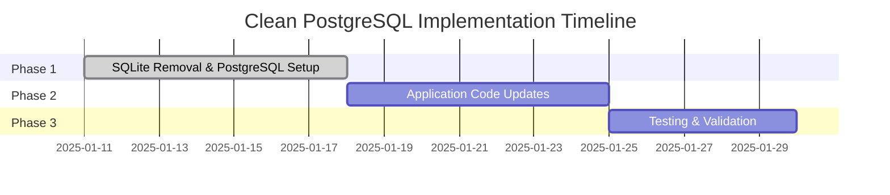
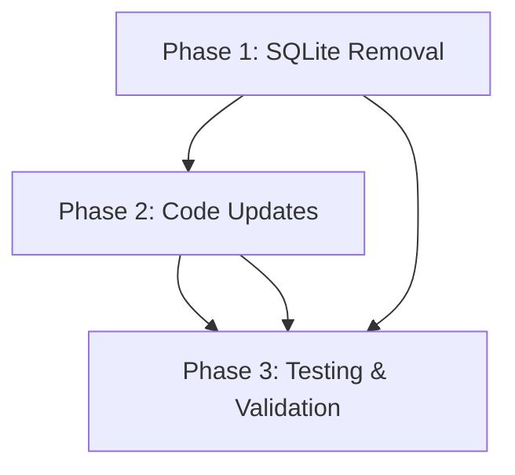

# SQLite Removal Plan - Clean PostgreSQL Implementation

## Overview

This directory contains a **clean PostgreSQL implementation strategy** for removing SQLite from the Hyperpage project. Instead of complex data migration, we're implementing a fresh PostgreSQL-only approach that leverages existing infrastructure while eliminating all SQLite complexity.

## Updated Plan Structure

The migration has been optimized into **3 strategic phases** over 2-3 weeks:

### 🗑️ Phase 1: SQLite Removal & PostgreSQL Setup
**Duration**: 1 week  
**Objective**: Remove all SQLite dependencies and establish PostgreSQL-only infrastructure

- Remove SQLite dependencies from package.json
- Clean up SQLite schema and connection logic
- Configure PostgreSQL-only database layer
- Update environment variables and configuration
- Remove dual-engine support complexity

### 🔧 Phase 2: Application Code Updates  
**Duration**: 1 week  
**Objective**: Update application to use PostgreSQL exclusively

- Update repository classes for PostgreSQL-only operation
- Clean up API endpoints and remove SQLite fallbacks
- Remove configuration complexity (DB_ENGINE, etc.)
- Update OAuth and job processing patterns
- Optimize for PostgreSQL-specific features

### 🧪 Phase 3: Testing & Validation
**Duration**: 3-5 days  
**Objective**: Comprehensive testing and production readiness

- Update all test infrastructure for PostgreSQL
- Validate performance and functionality
- Test deployment and operational procedures
- Final integration and acceptance testing

## Migration Decision: Clean Implementation vs Migration

### Why Clean Implementation?

**Original Migration Approach (6 phases, 8-12 weeks):**
- Complex data migration with high risk
- Blue-green deployment required
- Extensive rollback procedures needed
- Multiple validation layers required

**New Clean Implementation (3 phases, 2-3 weeks):**
- ✅ **No data migration complexity** - Start with fresh PostgreSQL
- ✅ **Existing PostgreSQL infrastructure** - Deployment already running
- ✅ **Modern architecture** - PostgreSQL-first design
- ✅ **Significantly reduced risk** - No data integrity concerns
- ✅ **Faster timeline** - 75% reduction in implementation time

### Risk Assessment Comparison

| Aspect | Migration Approach | Clean Implementation |
|--------|-------------------|---------------------|
| **Data Risk** | High - Migration complexity | None - Fresh start |
| **Technical Risk** | High - Rollback procedures | Low - Standard updates |
| **Timeline Risk** | High - Multiple phases | Low - Straightforward |
| **Resource Risk** | High - Specialized tooling | Low - Standard development |
| **Rollback Risk** | Complex blue-green deployment | Simple configuration revert |

## Migration Timeline

## Key Benefits of Clean Implementation

### Immediate Advantages
- **Simplified Architecture**: Single database engine (PostgreSQL only)
- **Better Performance**: PostgreSQL-optimized queries from day one
- **Cleaner Codebase**: No dual-engine complexity or SQLite fallbacks
- **Modern Standards**: Current best practices implementation

### Performance Improvements
- **Query Performance**: Expected 25-50% improvement over SQLite
- **Concurrent Users**: Support for 2x more concurrent users
- **Database Operations**: Enhanced indexing and query optimization
- **Connection Pooling**: Improved connection management and pooling

### Reliability & Security
- **Data Integrity**: ACID compliance with advanced transaction support
- **Backup & Recovery**: Modern backup and recovery capabilities
- **Security Features**: Advanced security and role-based access control
- **Monitoring**: Comprehensive monitoring and alerting capabilities

## Implementation Prerequisites

### Technical Prerequisites
- ✅ PostgreSQL infrastructure already available and configured
- ✅ Database migration scripts available (but not needed)
- ✅ Backup and recovery procedures documented
- ✅ Development team ready for PostgreSQL-only development

### Team Prerequisites
- ✅ Development team familiar with PostgreSQL
- ✅ Operations team prepared for PostgreSQL-only operations
- ✅ QA team briefed on simplified testing approach

## Success Criteria

### Data & Architecture
- [ ] SQLite completely removed from codebase
- [ ] PostgreSQL-only configuration implemented
- [ ] All application code uses PostgreSQL patterns
- [ ] Clean, modern architecture established

### Technical Success
- [ ] Application performance meets or exceeds baseline
- [ ] All tests pass with PostgreSQL-only configuration
- [ ] Monitoring and alerting operational
- [ ] Production deployment successful

### Operational Success
- [ ] Team comfortable with PostgreSQL operations
- [ ] Documentation complete and accurate
- [ ] Configuration simplified and maintainable

## Clean Implementation Readiness Checklist

### Pre-Implementation (Phase 1)
- [ ] PostgreSQL deployment validated and operational
- [ ] SQLite dependencies mapped and ready for removal
- [ ] Environment variables configured for PostgreSQL
- [ ] Development environment ready for PostgreSQL-only

### Implementation (Phases 2-3)
- [ ] Application code updated for PostgreSQL
- [ ] All SQLite references removed
- [ ] Comprehensive testing completed
- [ ] Production deployment successful

### Post-Implementation
- [ ] Performance benchmarks validated
- [ ] All functionality working as expected
- [ ] Operations team trained and comfortable
- [ ] Documentation updated and complete

## Emergency Procedures

### Simple Rollback Strategy
- **Configuration Revert**: Change database configuration back to SQLite if needed
- **Environment Switch**: Use dual-engine support already in place
- **Quick Recovery**: No complex blue-green deployment needed

### Support Structure
- **Database Issues**: PostgreSQL DBA support
- **Application Issues**: Development team lead
- **Performance Issues**: Performance engineering team

## Documentation Index

### Core Implementation Documents
- [`clean-postgresql-implementation.md`](clean-postgresql-implementation.md) - Detailed 3-phase implementation guide
- [`migration-decision-rationale.md`](migration-decision-rationale.md) - Decision analysis and comparison
- [`phase-1-sqlite-removal.md`](phase-1-sqlite-removal.md) - Phase 1 detailed procedures
- [`phase-2-code-updates.md`](phase-2-code-updates.md) - Phase 2 detailed procedures  
- [`phase-3-testing-validation.md`](phase-3-testing-validation.md) - Phase 3 detailed procedures

### Legacy Reference Documents
- [`legacy/`](legacy/) - Original 6-phase migration plan for reference
- [`legacy/migration-scripts/`](../scripts/) - Migration scripts (preserved for reference)

## Phase Dependencies

## Getting Started

1. **Review Prerequisites**: Confirm PostgreSQL infrastructure is ready
2. **Start with Phase 1**: Begin with SQLite removal and PostgreSQL setup
3. **Follow Sequential Order**: Complete each phase before moving to the next
4. **Monitor Progress**: Use the provided checklists to track completion
5. **Validate at Each Phase**: Ensure all criteria are met before proceeding

## Success Metrics

### Timeline Performance
- **Total Duration**: 2-3 weeks (as planned)
- **Phase Completion**: Each phase completed within estimated duration
- **No Major Delays**: Implementation stays on schedule

### Technical Performance
- **SQLite Removal**: 100% SQLite code removed
- **PostgreSQL Optimization**: Application optimized for PostgreSQL
- **Test Coverage**: >95% test pass rate across all test suites
- **Performance**: Improved query performance over baseline

### Business Impact
- **User Experience**: Improved system performance and reliability
- **System Reliability**: Enhanced system reliability and uptime
- **Scalability**: Enhanced system scalability for future growth
- **Operational Efficiency**: Simplified operations and maintenance

---

**Project Status**: Ready to Execute  
**Last Updated**: 2025-01-11  
**Implementation Lead**: [To be assigned]  
**Estimated Completion**: [To be scheduled]

For questions or clarifications about this clean implementation approach, please refer to the specific phase documents or contact the implementation project team.
