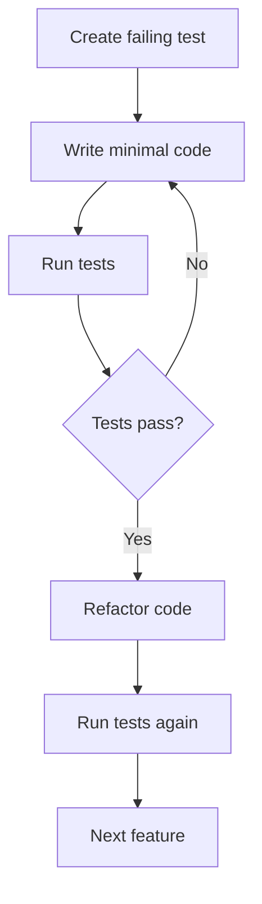

# Development Workflow for Testing

This document outlines the development workflow for writing, running, and maintaining tests in the Hyperpage project.

## Overview

Our development workflow is designed to ensure high code quality through comprehensive testing at every stage of development. The workflow integrates seamlessly with our test organization structure and supports both individual development and team collaboration.

## Test-Driven Development (TDD) Workflow

### 1. Feature Development with Tests

When implementing new features, follow this TDD-inspired workflow:



### Step-by-Step Process

#### Step 1: Write Test First

1. **Identify the behavior** you want to implement
2. **Write a failing test** that describes this behavior
3. **Use descriptive test names** that explain what should happen
4. **Set up realistic test data** and expectations

```typescript
// Example: Test first approach
describe("UserService", () => {
  describe("createUser", () => {
    it("should create user with encrypted password", async () => {
      // Test written before implementation
      const userData = {
        email: "user@example.com",
        password: "plaintextpassword",
        name: "Test User",
      };

      const result = await UserService.createUser(userData);

      expect(result).toHaveProperty("id");
      expect(result.email).toBe(userData.email);
      expect(result.name).toBe(userData.name);
      expect(result.password).not.toBe(userData.password);
      expect(result.encrypted).toBe(true);
    });
  });
});
```

#### Step 2: Write Minimal Implementation

1. **Write the simplest code** that makes the test pass
2. **Focus on functionality**, not optimization
3. **Use hardcoded values** if necessary to pass initial tests
4. **Don't worry about edge cases** yet

#### Step 3: Refactor and Improve

1. **Make the code more robust** while keeping tests passing
2. **Extract reusable functions** and components
3. **Add error handling** and validation
4. **Optimize performance** if needed

#### Step 4: Add Edge Cases

1. **Think of potential failure scenarios**
2. **Write additional tests** for edge cases
3. **Test error conditions** and boundary values
4. **Test integration points** with other components

## Daily Development Workflow

### 1. Starting Work

```bash
# 1. Pull latest changes
git pull origin main

# 2. Install dependencies
npm install

# 3. Run all tests to ensure clean state
npm test

# 4. Start development server
npm run dev
```

### 2. During Development

#### Unit Test Workflow

```bash
# Run unit tests in watch mode
npm run test:unit -- --watch

# Test specific file
npm test -- __tests__/unit/lib/my-function.test.ts

# Test by pattern
npm test -- --grep "authentication"

# Test with coverage
npm run test:unit -- --coverage
```

#### Integration Test Workflow

```bash
# Run integration tests
npm run test:integration

# Run specific integration test
npm test -- __tests__/integration/oauth/auth-flow.spec.ts

# Run with verbose output
npm run test:integration -- --reporter=verbose
```

### 3. Before Committing

```bash
# 1. Run full test suite
npm test

# 2. Run linting
npm run lint

# 3. Check TypeScript compilation
npm run type-check

# 4. Run specific test types
npm run test:unit
npm run test:integration
npm run test:performance
```

## Test Writing Guidelines

### 1. Unit Test Guidelines

#### Test Structure (AAA Pattern)

```typescript
describe("ComponentName", () => {
  describe("MethodName", () => {
    it("should do something specific", async () => {
      // Arrange
      const input = {
        /* test data */
      };
      const expected = {
        /* expected result */
      };
      const mock = vi.fn();

      // Act
      const result = await functionUnderTest(input);

      // Assert
      expect(result).toEqual(expected);
      expect(mock).toHaveBeenCalledWith(input);
    });
  });
});
```

#### Best Practices

- **One test, one behavior**: Each test should verify one specific behavior
- **Descriptive names**: Test names should read like sentences describing behavior
- **Minimal setup**: Keep test setup as simple as possible
- **Clear assertions**: Use specific matchers that clearly express what you're testing
- **Independent tests**: Tests should not depend on each other

#### Example: Good Unit Test

```typescript
describe("EmailValidator", () => {
  describe("validate", () => {
    it("should return true for valid email addresses", () => {
      // Arrange
      const validEmails = [
        "user@example.com",
        "test.email@domain.co.uk",
        "name+tag@company.org",
      ];

      // Act & Assert
      validEmails.forEach((email) => {
        expect(EmailValidator.validate(email)).toBe(true);
      });
    });

    it("should return false for invalid email addresses", () => {
      // Arrange
      const invalidEmails = [
        "invalid-email",
        "@domain.com",
        "user@",
        "user@domain",
        "user@.com",
      ];

      // Act & Assert
      invalidEmails.forEach((email) => {
        expect(EmailValidator.validate(email)).toBe(false);
      });
    });
  });
});
```

### 2. Integration Test Guidelines

#### Setup and Teardown

```typescript
describe("OAuth Integration", () => {
  let testServer: TestServer;
  let testUser: User;

  beforeAll(async () => {
    // Set up test environment
    testServer = await setupTestServer();
    testUser = await createTestUser();
  });

  afterAll(async () => {
    // Clean up test environment
    await cleanupTestServer();
    await deleteTestUser(testUser.id);
  });

  beforeEach(async () => {
    // Reset state before each test
    await resetTestDatabase();
  });

  it("should complete OAuth flow successfully", async () => {
    // Test implementation
  });
});
```

#### Real vs Mock Data

- **Use real data** for integration tests where appropriate
- **Mock external services** that are not under test
- **Set up realistic test scenarios** that match production usage
- **Clean up test data** after each test

### 3. Component Test Guidelines

#### React Testing Library Best Practices

```typescript
import { render, screen, fireEvent, waitFor } from '@testing-library/react';
import userEvent from '@testing-library/user-event';

describe('UserForm Component', () => {
  it('should submit form with user data', async () => {
    const user = userEvent.setup();
    const mockSubmit = vi.fn();

    render(<UserForm onSubmit={mockSubmit} />);

    // Fill form fields
    await user.type(screen.getByLabelText(/email/i), 'user@example.com');
    await user.type(screen.getByLabelText(/name/i), 'John Doe');

    // Submit form
    await user.click(screen.getByRole('button', { name: /submit/i }));

    // Wait for async operations
    await waitFor(() => {
      expect(mockSubmit).toHaveBeenCalledWith({
        email: 'user@example.com',
        name: 'John Doe'
      });
    });
  });

  it('should show validation errors for invalid input', async () => {
    const user = userEvent.setup();
    render(<UserForm onSubmit={vi.fn()} />);

    // Submit empty form
    await user.click(screen.getByRole('button', { name: /submit/i }));

    // Check for validation messages
    expect(screen.getByText(/email is required/i)).toBeInTheDocument();
    expect(screen.getByText(/name is required/i)).toBeInTheDocument();
  });
});
```

## Test Maintenance

### 1. Regular Test Reviews

#### Weekly Test Health Checks

```bash
# Check test coverage trends
npm run test:coverage -- --reporter=json --outputFile=coverage/coverage.json

# Identify slow tests
npm test -- --reporter=verbose | grep 'slow'

# Check for flakiness
npm test -- --repetitions=5 --reporter=dot
```

#### Test Code Review Checklist

- [ ] Tests have clear, descriptive names
- [ ] Tests follow the AAA pattern (Arrange, Act, Assert)
- [ ] Tests are independent and don't rely on each other
- [ ] Tests use appropriate mocks and test data
- [ ] Tests cover happy paths and error scenarios
- [ ] Tests are readable and maintainable
- [ ] Tests run consistently and don't have race conditions

### 2. Test Performance Monitoring

#### Performance Test Suite

```typescript
// __tests__/performance/api/response-time.test.ts
describe("API Response Time Performance", () => {
  const testCases = [
    { endpoint: "/api/tools", expected: 200 },
    { endpoint: "/api/health", expected: 100 },
    { endpoint: "/api/metrics", expected: 500 },
  ];

  testCases.forEach(({ endpoint, expected }) => {
    it(`should respond to ${endpoint} within ${expected}ms`, async () => {
      const startTime = performance.now();

      const response = await fetch(`http://localhost:3000${endpoint}`);

      const endTime = performance.now();
      const responseTime = endTime - startTime;

      expect(response.status).toBe(200);
      expect(responseTime).toBeLessThan(expected);
    });
  });
});
```

### 3. Test Environment Management

#### Development Environment

```bash
# Start test database
npm run test:db:start

# Run tests with test environment
NODE_ENV=test npm test

# Run tests with specific configuration
npm test -- --config=vitest.config.ts
```

#### Continuous Testing

```bash
# Watch mode for TDD
npm test -- --watch

# Auto-run tests on file changes
npm run test:watch

# Run tests in CI mode
npm test -- --ci
```

## Team Collaboration

### 1. Code Review Process

#### Test Review Guidelines

When reviewing code that includes tests:

1. **Review test logic**: Ensure tests actually test what they claim to test
2. **Check test coverage**: Verify new code is adequately tested
3. **Review test names**: Ensure tests have descriptive, meaningful names
4. **Check for flakiness**: Look for tests that might fail inconsistently
5. **Review test performance**: Ensure tests run reasonably fast

#### Review Checklist

- [ ] New tests follow established patterns
- [ ] Test coverage is adequate for new code
- [ ] Tests are independent and can run in any order
- [ ] Test setup and teardown are proper
- [ ] Mock data and external dependencies are appropriate
- [ ] Tests have clear failure messages

### 2. Shared Testing Utilities

#### Common Test Helpers

```typescript
// __tests__/utils/test-helpers.ts
export const createMockUser = (overrides = {}) => ({
  id: "test-user-id",
  email: "test@example.com",
  name: "Test User",
  createdAt: new Date("2023-01-01"),
  ...overrides,
});

export const createMockTool = (overrides = {}) => ({
  id: "test-tool",
  name: "Test Tool",
  enabled: true,
  config: {},
  widgets: [],
  ...overrides,
});

export const setupTestDatabase = async () => {
  // Database setup logic
};

export const cleanupTestDatabase = async () => {
  // Database cleanup logic
};
```

#### Shared Test Constants

```typescript
// __tests__/constants/test-constants.ts
export const TEST_USERS = {
  admin: {
    id: "admin-user",
    email: "admin@example.com",
    role: "admin",
  },
  regular: {
    id: "regular-user",
    email: "user@example.com",
    role: "user",
  },
};

export const TEST_TOOLS = {
  github: {
    name: "GitHub",
    enabled: true,
    config: { token: "test-token" },
  },
  jira: {
    name: "Jira",
    enabled: false,
    config: {},
  },
};
```

## Continuous Integration

### 1. Pre-commit Hooks

```json
// package.json
{
  "lint-staged": {
    "*.{ts,tsx}": [
      "eslint --fix",
      "prettier --write",
      "npm run type-check",
      "npm run test:unit"
    ]
  }
}
```

### 2. CI/CD Pipeline Integration

```yaml
# .github/workflows/test.yml
name: Test Suite

on: [push, pull_request]

jobs:
  test:
    runs-on: ubuntu-latest
    steps:
      - uses: actions/checkout@v3
      - uses: actions/setup-node@v3
        with:
          node-version: "18"

      - run: npm install
      - run: npm run type-check
      - run: npm run lint
      - run: npm run test:unit
      - run: npm run test:integration
      - run: npm run test:performance
```

## Troubleshooting Common Issues

### 1. Test Timing Issues

```typescript
// Use waitFor for async operations
await waitFor(
  () => {
    expect(screen.getByText("Success")).toBeInTheDocument();
  },
  { timeout: 5000 },
);

// Use fake timers for time-dependent code
vi.useFakeTimers();
vi.advanceTimersByTime(1000);
```

### 2. Mock Conflicts

```typescript
// Clear mocks between tests
afterEach(() => {
  vi.clearAllMocks();
  vi.restoreAllMocks();
});
```

### 3. Test Data Conflicts

```typescript
// Use unique test data
const uniqueId = `test-${Date.now()}-${Math.random()}`;
const testUser = { ...baseUser, id: uniqueId };
```

## Success Metrics

### Test Health Indicators

- **Test Coverage**: >90% for critical paths
- **Test Execution Time**: <2 minutes for unit tests
- **Flaky Test Rate**: <1% of total test runs
- **Code Review Coverage**: 100% of code changes reviewed

### Performance Targets

- **Unit Tests**: <1 second average
- **Integration Tests**: <10 seconds average
- **Full Test Suite**: <5 minutes
- **Test Environment Setup**: <30 seconds

## Conclusion

This development workflow ensures that:

- All code changes are properly tested
- Tests are maintainable and provide value
- The development process is efficient and reliable
- Team collaboration is smooth and effective
- Code quality remains high over time

For questions or suggestions about this workflow, please discuss with the development team or create an issue in the project repository.
